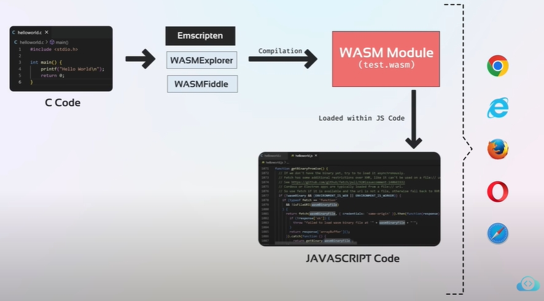

# Web-Assembly

## what is web-assembly?

* A low-level assembly-like language. (You need to understand it to know what compiler is doing)

* Web-Assembly can also be run in the browser. They can interrupt each other. we don't have to choose between them. It is designed to run alongside JavaScript, allowing both to work together. (Webassembly 的目的在於可以用更高的效能去處理以往 Javascript 做不到的事情，像是遊戲、3D、影片剪輯、VR等。，他不是要來取代 javascript 的而是彼此相輔相乘讓網頁的未來有更多的可能。)

* it provides a way to run code written in multiple languages on the web at near native speed, with client apps running on the web that previously couldn't have done so.

* 提供一個虛擬機器VM，可以在瀏覽器中運行低階的二進制指令碼。

* be written in C/C++/Rust ..., will be compile to a form that looks like an assembly can be read by javascript and be run on the browser.

---

 
 [What is WebAssembly? And what's it got to do with Docker? | WASM vs Docker | KodeKloud (video by KodeKloud)](https://www.youtube.com/watch?v=7553XZ0T6pM)

  

---

reference:

* kodekloud